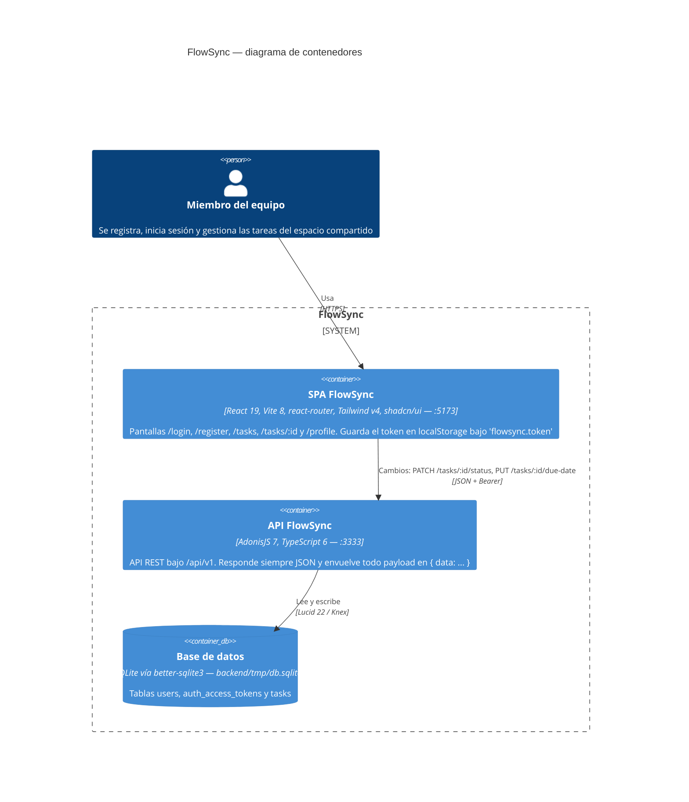
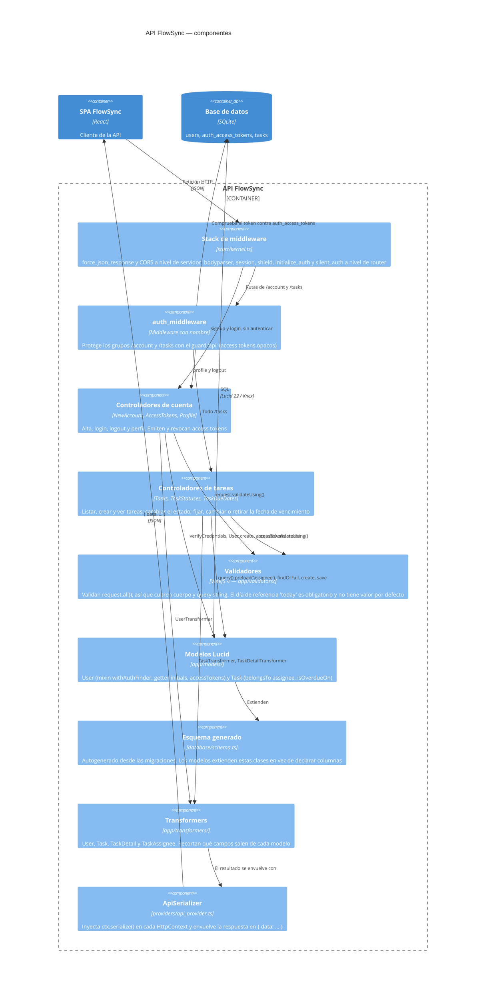
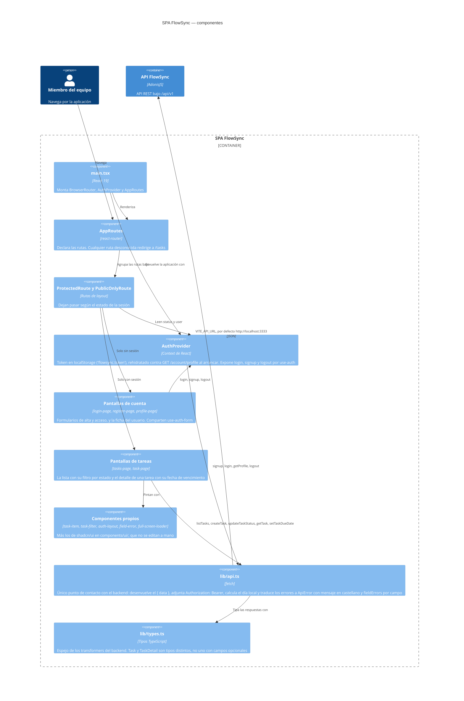

# Arquitectura de FlowSync

Este documento describe las piezas que FlowSync ejecuta de verdad y cómo se
hablan entre ellas. El diagrama principal es el **de contenedores (C4 nivel 2)**:
tres cosas que se arrancan por separado —la SPA que sirve Vite, la API de
AdonisJS y el fichero SQLite— y las llamadas HTTP concretas que las unen. Debajo
hay dos diagramas de componentes (nivel 3) para el interior de cada aplicación,
y una tabla de las rutas reales.

Todo está sacado de leer el código: las rutas de `backend/start/routes.ts`, el
stack de middleware de `backend/start/kernel.ts`, los controladores, validadores,
transformers y modelos de `backend/app/`, las tablas de
`backend/database/migrations/`, y el lado cliente de `frontend/src/`. Las
etiquetas de las flechas son llamadas que existen en `frontend/src/lib/api.ts`,
el único sitio del frontend que hace `fetch`.

Lo que **no** se dibuja también es deliberado. No hay despliegue, ni cachés, ni
colas, ni un cliente tipado Tuyau en el frontend: el registro de
`backend/.adonisjs/client/` existe, pero hoy solo lo consume
`backend/tests/bootstrap.ts`. El guard `web` de sesión está configurado en
`config/auth.ts` y ninguna ruta lo usa, así que tampoco aparece.

## Contenedores (C4 nivel 2)

## Componentes de la API (C4 nivel 3)

## Componentes de la SPA (C4 nivel 3)

## Las rutas, una por una

Todas cuelgan de `/api/v1` y salen de `backend/start/routes.ts`. «Auth» significa
que el grupo lleva `.use(middleware.auth())`.

| Método | Ruta | Controlador | Validador | Transformer | Auth |
|---|---|---|---|---|---|
| POST | `/auth/signup` | `NewAccountController.store` | `signupValidator` | `UserTransformer` | no |
| POST | `/auth/login` | `AccessTokensController.store` | `loginValidator` | `UserTransformer` | no |
| GET | `/account/profile` | `ProfileController.show` | — | `UserTransformer` | sí |
| POST | `/account/logout` | `AccessTokensController.destroy` | — | — (devuelve `{ message }` sin envolver) | sí |
| GET | `/tasks` | `TasksController.index` | `listTasksValidator` | `TaskTransformer` | sí |
| POST | `/tasks` | `TasksController.store` | `createTaskValidator` | `TaskTransformer` (201) | sí |
| GET | `/tasks/:id` | `TasksController.show` | `taskReferenceDayValidator` | `TaskDetailTransformer` | sí |
| PATCH | `/tasks/:id/status` | `TaskStatusesController.update` | `updateTaskStatusValidator` | `TaskTransformer` | sí |
| PUT | `/tasks/:id/due-date` | `TaskDueDatesController.update` | `setTaskDueDateValidator` | `TaskDetailTransformer` | sí |

Fuera de `/api/v1` solo existe `GET /`, que devuelve `{ hello: 'world' }`.

## Decisiones que el diagrama no puede enseñar

- **El token manda.** El guard por defecto es `api`: access tokens opacos vía
  `DbAccessTokensProvider`, guardados en `auth_access_tokens`. El frontend los
  mete en `localStorage` y los manda en cada petición protegida; un 401 se
  traduce a «Tu sesión ha caducado» y cierra la sesión local.
- **Nada sale crudo.** Ningún controlador devuelve un modelo: todo pasa por un
  transformer y por `serialize()`, que envuelve en `{ data }`. El frontend
  desenvuelve ese `data` en `lib/api.ts` y en ningún otro sitio.
- **El vencimiento se decide al mirar, no se guarda.** `isOverdue` no es una
  columna: lo calcula `Task.isOverdueOn(referenceDay)` con el día que manda el
  cliente. Por eso `today` es obligatorio en `GET /tasks/:id` y en
  `PUT /tasks/:id/due-date`, y por eso solo `TaskDetailTransformer` expone
  `dueDate` e `isOverdue` — la lista usa otro transformer y no puede enseñarlos.
- **El responsable viaja recortado.** `TaskAssigneeTransformer` expone `id`,
  `fullName` e `initials`, y no reutiliza `UserTransformer`, que incluiría el
  email y las fechas de la cuenta.
- **La lista es del espacio, no de cada uno.** `TasksController.index` no filtra
  por usuario. Sin `?status` devuelve `pending` e `in_progress`; lo hecho queda
  fuera salvo que se pida explícitamente.
- **Cualquiera con sesión puede cambiar cualquier tarea.** Ni el cambio de
  estado ni el de fecha comprueban quién es el responsable.
- **El esquema se genera.** `database/schema.ts` sale de las migraciones
  (`schemaGeneration.enabled` en `config/database.ts`) y no se edita a mano; los
  modelos solo añaden relaciones, mixins, getters y lógica.
- **Una sola base de datos.** `config/database.ts` define una única conexión
  SQLite sin override por entorno, así que los tests functional de
  `backend/tests/functional/` pegan contra el mismo fichero que el servidor de
  desarrollo.
